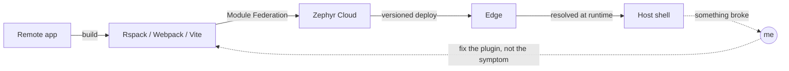

<div align="center">

# Rodrigo Yokota

**Platform Engineer @ [Zephyr Cloud](https://zephyr-cloud.io)** · Module Federation whisperer · full-stack since 2018

[](https://yokota.dev)
[](https://www.linkedin.com/in/rodrigo-yokota/)
[](mailto:rodrigo@yokota.dev)
[](https://drive.google.com/uc?export=download&id=1Q_JRCt0mZmhP7ieBWEMdeMBt8gAwfTA8)

</div>

---

### `whoami`

```ts
const rodrigo = {
  role: 'Platform Engineer @ Zephyr Cloud',
  from: 'Maringá, PR 🇧🇷',
  since: 2018,
  doing: ['module federation', 'build tooling', 'cloud deploy pipelines', 'DX that does not hurt'],
  stack: ['TypeScript', 'Node.js', 'React', 'Rspack', 'Webpack', 'Vite', 'Nx', 'AWS'],
  alsoWrites: ['Swift', 'Python', 'PHP', 'Dart', 'a suspicious amount of YAML'],
  motto: 'Ship it, then make it boring.',
} as const;
```

### What I actually do all day

Micro-frontends are easy to draw and hard to ship. My job is the arrow nobody likes.



- Build-tool plugins and integrations across **webpack, Rspack, Vite, Rollup, Nx, Next.js, Astro, Tauri**
- Module Federation consulting: turning "why is React loaded twice" into a Monday-morning answer
- Reference examples, repros, and the unglamorous issue-replication repos that make bugs fixable

### Track record

| When | Where | What |
| --- | --- | --- |
| 2023 → now | **Valor Software / Zephyr Cloud** | Zephyr platform features, Module Federation consulting, standards & architecture |
| 2023 | **Vaullti** (Seattle) | Digital-twin protection service: AWS CDK, event-driven workflows, cost-first design |
| 2021 → 2023 | **Groundbreaker** (Chicago) | Fund administration: React → federated micro-frontends, Go → Node.js serverless |
| 2020 → 2021 | **Gazin Tech** | E-commerce apps, new mobile app + APIs, checkout as a micro-frontend |
| 2019 → 2020 | **Vivaworks** | Corporate suite: PHP/Zend, Flutter app, the module everyone was afraid of |
| 2015 → 2019 | **Full House** | Ran ops & finance. Automated my own job with VBA. That's how this started. |

<sub>AWS Certified Cloud Practitioner · Computer Science @ UEM (unfinished, still curious)</sub>

### Toolbox


### Side quests

| Project | The pitch |
| --- | --- |
| [**guaranate**](https://github.com/ryok90/guaranate) | Native macOS keep-awake CLI in Swift. Talks to IOKit directly, does **not** wrap `caffeinate`. Named after guaraná, because Brazil solves caffeine differently. `brew install ryok90/guaranate/guaranate` |
| [**nextjs-mf-examples**](https://github.com/ryok90/nextjs-mf-examples) | Next.js ↔ Module Federation, working, with receipts |
| [**yokota.dev**](https://github.com/ryok90/yokota.dev) | My corner of the internet. Next.js, teal, opinionated |
| [**tapple**](https://github.com/ryok90/tapple) | The board game Tapple, dragged onto the web |
| [**zmk-config**](https://github.com/ryok90/zmk-config) | 36-key Corne layout. Yes, I have opinions about layers |

### Fun facts

- I spent four years running events ops before writing code professionally. Spreadsheets radicalized me.
- If a bug can't be reproduced in a clean repo, it isn't a bug yet — hence the small pile of `*-issue-replication` repos.
- I'll take a boring solution over a clever one, right up until the boring one gets slow.

<div align="center">

[](https://github.com/ryok90?tab=followers)
[](https://github.com/ryok90?tab=repositories&q=&type=source&sort=stargazers)
[](https://github.com/ryok90)

<sub>Want to talk federated frontends, build pipelines, or keyboards? <a href="mailto:rodrigo@yokota.dev">rodrigo@yokota.dev</a></sub>

</div>
